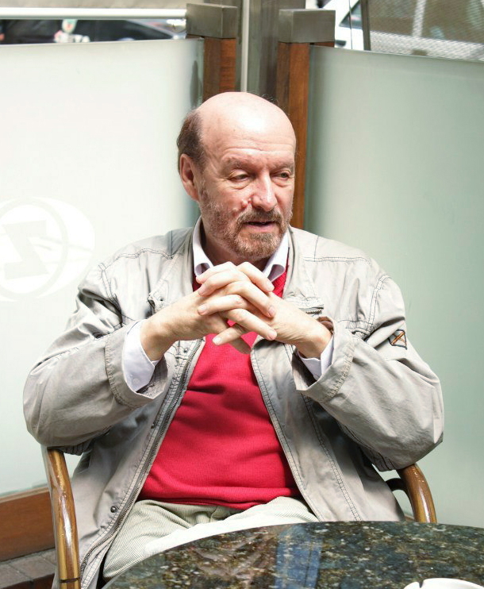

# М. А. Левшин: Актер в современном театре

Размышляя на тему «актер в современном театре», хочу начать с мысли о том, что живой действующий актер — это основной «материал» театрального искусства.

Для того, чтобы начался «театр», достаточно двух человек и взаимодействия между ними, больше ничего, собственно, может и не быть.

Именно действующий актер, добивающийся цели в ситуации, предложенной драматургом, на мой взгляд, должен оставаться основной движущей силой театральной постановки.

Наличие и главенство актерской индивидуальности над всеми остальными компонентами спектакля в настоящее время начало серьезно «размываться». Актер подчас становится «заполнителем» некоего пространственного решения, когда его действующая энергия, затраченная на достижение целей драматурга, и воздействие на партнера перестает быть основными.

На место психологической игры приходит выполнение ряда определенных режиссером «функций» и воспроизведение текста, его «звукоизвлечение».

Часто режиссерская «работа» с актером ограничивается подбором подходящего типажа или актерское амплуа. А индивидуальность актера и его талант просто перестают быть нужны.

Вообще, существует много определений таланта. Станиславский говорил о таланте так: «Талант актера измеряется количеством неожиданных, но закономерных приспособлений в единицу времени». Мне нравится такое «определение»: «Талант — это когда человек всегда в ударе». То есть человека, в данном случае — актера, не покидает вдохновение, он творит и импровизирует без конца. Наш выдающийся актер Сергей Юрский говорил: «Ужасно люблю импровизировать в точно найденной схеме». Актер ведет себя неожиданно, но мы понимаем его, «считываем» его сценическую жизнь и сопереживаем.

Поэтому эти актерские «приспособления» закономерны, но в то же время они неожиданны. Ведь режиссер определяет — что должен делать актер, а сам актер, исходя из своего актерского таланта, решает — как он должен это сделать. Иногда артисты начинают неожиданно смеяться или плюхаться на стул в тот момент, когда, казалось бы, нужно вскочить от счастья. И эти их непрямолинейные реакции гораздо больше подчеркивают образ. Такая парадоксальность поведения, как правило, очень сильно воздействует на зрителя.

Будучи в Америке, я попал на спектакль режиссера М. Циммерман «Метаморфозы Овидия», который получил приз «За гениальность». Когда я его смотрел, у меня было полное ощущение, что я сижу на спектакле студенческой самодеятельности. Большая часть участников спектакля актерски почти никак не оснащена. А система построения спектакля такая: режиссер придумывает неожиданные ходы, а зрителям остается многое домысливать самостоятельно. Публика присутствует при таком своеобразном зрелище, которое мне напомнило наши КВНы, где разные ситуации отношений между персонажами «разрешаются» по средствам остроумных решений. Последнее время подобный «метод» начал «заползать» и в наши театры, молодая актерская тусовка может играть в такого рода постановках, так ни разу и «не прожив», например, «Ромео и Джульетту».

Но, все-таки, зритель приходит в театр. Статистика говорит: самый надежный способ привлечь зрительское внимание к тем или иным театральным проектом — наличие в них известных актеров. Подсчитано, что 70% зрителей приходят в театр на конкретную постановку потому, что видели раньше кого-то из актеров в кино или что-то о нем слышали.

Но зритель ходит на спектакли не только из желания увидеть «живьем» актеров, которых он видел с экрана, а потому, что есть интерес к конкретному актеру.

Были времена, когда у театральных режиссеров — руководителей театра — была потребность в создании компании, содружества актеров. Так в 1956 году в Москве Олег Ефремов создал «Современник», где сосуществовали ярчайшие актеры О. Табаков, И. Кваша, Е. Евстигнеев, чуть позже к ним присоединились С. Любшин, Н. Дорошина, М. Казаков, П. Щербаков.

В том же 1956 году в Ленинграде Георгий Товстоногов начал собирать блестящую плеяду актеров БДТ — П. Луспекаев, В. Стржельчик, К. Лавров, Т. Доронина, И. Смоктуновский. Какие творческие индивидуальности! Какие человеческие личности!

А сейчас может появиться театр, но совершенно не обязательно в этом театре возникнут актерские индивидуальности. Зачастую возникнет просто брэнд какого-то режиссерского почерка (если, конечно, он есть), или срабатывает обычное фрондерство. Так, например, в спектаклях какого-либо театра актеры то и дело раздеваются до гола, или выполняют близкие к смертельным трюки, или на сцене просто ругаются матом.

Вообщем, происходит девальвация театра, самым главным выразителем которого всегда был актер, с которым поработал режиссер.

Постепенно рождается ощущение, что для того, чтобы актерам и актрисам выходить на сцену достаточно просто выучить текст и вести себя раскованно и уверенно. А все, что касается эмоционального напряжения, актерской работы, то все это куда-то отодвигается.

И все меньше мы видим подлинные актерские личности.

Об актерах можно говорить бесконечно — какие они неожиданные и непредсказуемые, какие они жестокие и наивные одновременно. Совершенно точно написал в своей книге А. Эфрос: «Актеры — женская половина человечества, они должны нравиться, как женщины нравятся мужчинам».

Актер — профессия зависимая, актер зависит от всех — от режиссеров, от пьесы, от зрителей. От всего этого в конечном итоге зависит актерская судьба и жизнь. Но при этом актерская профессия — была и остается одной из самых привлекательных.

Представители других творческих профессий, например, художники, сначала должны нарисовать, потом добиться размещения своих картин на выставке, потом, может быть, критики от искусства что-то напишут или скажут. То есть, от создания объекта искусства до его оценки может пройти большое количество времени.

В актерстве — не так. Ведь, находясь на сцене, сегодня, здесь и сейчас актер сразу получает одобрение своему дару от нескольких сотен зрителей. И поэтому «наркоз» оценивающего зрительного зала трудно переоценить или сравнить с чем-либо другим, что приносило бы человеку-актеру такой восторг и удовлетворение.

Чаще всего, ступив на путь актерства и изведав зрительского внимания, люди уже не сворачивают с него. И неудивительно, когда спрашивают у пожилых актеров — если бы им довелось прожить жизнь еще раз, выбрали бы они снова актерскую профессию, всегда слышат один и тот же ответ — «да, конечно, я бы снова стал актером». Ведь мало кто может сравниться с актерами таким течением жизни, где столько разнообразных встреч, ситуаций, эмоциональных коллизий и, главное, — массового внимания, признания и любви.

В Санкт-Петербурге стало доброй традицией каждый год в самом конце весны в Доме актера на Невском устраивать вечер «Посвящения в артисты». На него приглашаются молодые актеры, которые уже год отработали в театрах и тем самым подтвердили, прежде всего, самим себе, что они серьезны в своем выборе актерской профессии. В прошлом году мы «посвящали» молодого актера нашего театра «Комедианты» Илью Безрука.

Наш выдающийся режиссер театра А. А. Белинский на очередном таком вечере, обращаясь к молодым актерам, сказал: «Запомните, мои молодые друзья! Лучше театра ничего не придумано!» И то, насколько это правда, лучше всего ощущают сами актеры.
