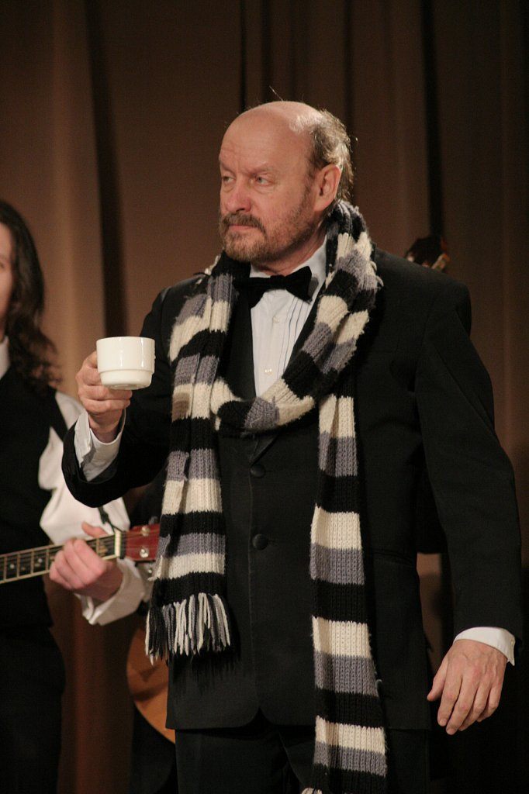

З.д.и. России Михаил Левшин

Весь мир стремится к переменам, эти перемены постоянно происходят в сознании людей. Далеко ходить не нужно — противостояние на Украине, естественное желание перемен, только вот, почему-то организованное Западом, оттуда подпитываемое и подкармливаемое. Это порождает странный парадокс — мы хотим перемен просто ради перемен, независимо и не разбираясь в том — к лучшему они или к худшему.

Но, причем здесь театр? Мне кажется, что мы порой идем той же дорогой. Недавно я слышал по телевизору в интервью руководителя театра «Геликон-Опера» Дмитрия Бертмана о том, что, набирающий у нас обороты, формальный, безусловно, необычный театр, уже давно занявший прочные позиции в Европе — он не имеет всего лишь главного — зрительского спроса. Что же это за искусство — для самих себя и знакомых? То, что было в нашем театре при Советском союзе, вспомним хотя бы Товстоногова — огромные очереди у касс, «Нет ли лишнего билетика?» у входа в театр — это ли не важно? Сама основа драматического театра — с сюжетом, с сопереживанием, потеряла ценность сегодня? Я не побоюсь сказать, что элитарность искусства губит интерес зрителя. Например, когда в театре не происходит момент узнавания, сопереживания. Только в литературе и театре могут быть вполне реальные ассоциации, это важно для читателя и зрителя, а некий новый театр предлагает ассоциации часто условные, как в музыке или живописи… но это уже другие виды искусства. Скандальные назначения в Москве, назначение у нас Могучего в БДТ, видимо, означает, что где-то наверху считают, что и наше искусство должно быть на этом европейском некоем формально-фестивальном уровне. Но ведь и в Европе есть исключения. Недавно в Париже я посетил спектакль театра Питера Брука, знаменитого театрального экспериментатора, и увидел психологический, традиционный в хорошем смысле этого слова, театр. «Школа Мейерхольда делала акцент на выразительности тела. Гротовский по-своему развил это направление и вызвал особый интерес к языку тела и движения. С другой стороны, Брехт настаивал на том, что актёр должен быть не наивным дурачком, каковым его считали в девятнадцатом веке, а думающим, размышляющим человеком своего времени. Школа Станиславского и её последователи уделяли огромное внимание проблемам эмоциональной погруженности актера в роль. Все три направления необходимы!» — это его слова. Но, мы отвлеклись.

Наше безусловное преимущество — это русский психологический театр. За это нас любили и учились у нас в той же самой Европе, где с неизменным успехом гастролировали такие мастера как Товстоногов и Додин… Не многим ли мы жертвуем сегодня и ради чего?

Следующий год объявлен Годом культуры. Так давайте сохранять нашу русскую культуру, только и всего.

Хочется привести несколько высказываний:

Первое, наверное, самое спорное и часто цитируемое — это «Доктрина Далласа», сформулированная директором ЦРУ, Аленом Далласом — <em>«Будем вырывать духовные корни, опошлять и уничтожать основы народной нравственности. Мы будем, таким образом, расшатывать поколение за поколением, мы будем браться за людей с детских и юношеских лет, будем всегда главную ставку делать на молодежь. Станем разлагать, развращать, растлевать ее. Мы будем расшатывать, таким образом, поколение за поколением… Мы сделаем из них молодых циников, пошляков, космополитов»</em>.

И вот, как ответ, мне хочется процитировать высказывание Льва Додина на недавно прошедшем в Петербурге II Международном культурном форуме:

<blockquote>«Великое заблуждение думать, что молодёжь сегодня хочет только развлекаться. У неё огромная потребность в серьёзном театре. Мы порой очень преувеличиваем возможности шоу-бизнеса и всякого рода гламурного искусства. Одна из главных проблем, которая обсуждается на форуме — как максимально увеличить содержательность театра и привлекать людей, обнаруживая в них то, что они сами про себя не знают, но в чем у них есть потребность — в глубоком переживании и сострадании.

Язык сцены — уникальный способ общения, и наша задача — увеличить долю серьёзного искусства, которое, разумеется, не может быть коммерческим».</blockquote>

Кто мы такие, русские, русскоязычные, со своими особенностями, в чем наш потенциал, желание развития, а не ставшее лично для меня уже пресловутым желание неких перемен?

Но все вышесказанное для нас — это повод и причина(иначе не согласуется) действовать в выбранном нами направлении — сохранять и охранять великие традиции от вандализма непрофессионалов и выскочек, работать, создавать спектакли про русского человека и для русского человека, воспитывать новые поколения в любви к русскому искусству.

Ведь есть понятие моды, популярности, а есть понятие сущностной ценности.

Чтобы не быть голословными, приглашаем Вас в следующем году на премьеру спектакля по рассказам В. Шукшина «Земляки». Материал, который мы выбрали для постановки, — это истории о наших соотечественниках, «земляках». Действие спектакля представлено, как концерт в сельском клубе, который, как часто практиковалось в то время, был обустроен прямо в церкви. И герои, рассказывая свои смешные и грустные истории, сами того не осознавая, начинают исповедоваться-то есть очищаться. Мы не говорим о религии, о ней тоже сейчас слишком много говорят и превращают все в балаган. Мы говорим о великой духовности русского народа. Герои наших рассказов, быть может, не состоялись, в современном потребительском смысле этого слова, но они оказываются способны совершить настоящий духовный подвиг. А способны ли мы?