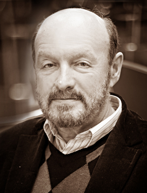

> В рубрике «Колонка главного режиссера» мы будем публиковать размышления о состоянии, проблемах и достижениях современного театра художественного руководителя и главного режиссера театра «Комедианты» з.д.и. России Михаила Левшина.

## М. А. Левшин

# «Сохраним традиционный психологический театр»

Я всю жизнь занимаюсь театром и меня, как режиссера, волнует и даже печалит его теперешнее состояние.

Если перелистать историю театра, то обнаружится, что в какие-то времена театр как бы пропадал. Нет пьес этого времени, на мой взгляд, нет выдающихся или даже «текущих» достижений в искусстве и не только. Это зачастую оправдывалось периодами тяжелого безвременья, войнами и т. д.

Что мы наблюдаем сегодня? Поведение людей изменяется, нормой становятся поступки и действия, которые были не то, чтобы порицаемы еще 40 лет назад, но которые вообще было трудно себе представить в отношении людей друг к другу. Например, чтобы ученики били учительницу или наоборот, да еще все это тут же становилось объектом массового просмотра в Интернете.

При всем том идеологическом давлении и зажиме свободной мысли, под знаком которого существовала страна в советский период, были у той тотальной цензурированности и преимущества. Никто и нигде не смел позволить себе опуститься до элементарной распущенности. И вдруг оказалось, что «можно все».

Наше театральное сообщество неожиданно рвануло в «новое театральное пространство» с такой силой, что за нами не угнаться западным театральным авангардистам. С такой мощью в России являют приверженность авангардизму и «свободе» в современном театральном процессе!

Проблема современного театра заключается в том, что он теряет основной признак этого вида искусства — жанр, он становится попросту размыт. Если в музыке остались традиционные ноты, гармония, мелодия, то в театре все смешалось, изменилось до неузнаваемости или исчезло.

В драматическом театре перестал главенствовать основной и определяющий его признак — примат драматургии. Стало вторичным воспроизведение «авторского голоса» в пьесе. Стало возможным и привычным частичное или полное нарушение авторских идей. Современная трактовка классических пьес порой даже не интерпретация, а подмена, подмена авторства драматурга режиссерским авторством. Режиссура идет либо впереди автора, либо вообще занимает его место.

Все, что когда-то было определено еще Аристотелем и принято на протяжении столетий, а потом утверждено русскими великими режиссерами конца 19 — 20 веков, в Европе и, особенно в России, вдруг было снесено разрушительным ветром. «Это сладкое слово «свобода» в очередной раз начало буквально крушить отечественный театр.

Но, ведь, это уже было. Вспомним театр «Колумб» из «Двенадцати стульев» Ильфа и Петрова. Авторы ничего не выдумывали, когда писали про постановку классической Гоголевской «Женитьбы» силами театра «Колумб». Они просто создали собирательный образ того уродливого явления, которое пыталось утвердить себя в 20-х годах ХХ века в так называемом «революционном» искусстве.

Именно тогда начали предприниматься активные попытки «самовыражения» под видом постановок классических пьес через различные трюки и всевозможные, не имеющие никакого отношения к драматическому театру, внешние атрибуты. Вспомним хотя бы Агафью Тихоновну, которая в трико телесного цвета и котелке «гукалась» на Воробъяниновских стульях или бедолагу-жениха Яичницу, превращенного волей «режиссера» в «просто» яичницу, которую уплетали прямо на сцене Агафья Тихоновна со Степаном.

Театр — искусство коллективное и синтетическое, слагаемое из множества других. Эта синтетичность в современном театре начинает превалировать над основными его составляющими, и главное — над актерской игрой.

Основным участником и созидателем театра всегда был живой артист, реализующий полностью весь свой арсенал, а не только внешние возможности. Если на сцене есть два актера и коврик, и между ними начинается взаимодействие, то это уже театр.

Более того, театр психологический игровой призван не к одномоментности показа какой-то эмоции или мысли, а к постепенному раскрытию этой мысли на протяжении спектакля. И главная роль в этом принадлежит актеру. А все остальное вещественное и музыкальное сопровождение аккомпанирует актерской игре. В нынешней подавляющей синтетичности и внешне эффектной визуальной зрелищности актерская игра просто перестает быть «слышна».

Очень часто в современном театре создаются сценические зрелища «на тему», но не всегда в них присутствует идея. Ведь идея — это некий призыв, мысль, соединенная с желанием.

Вот мы поставили «Лес» Островского, где через всю пьесу проходит мысль о том, что многие люди страдают постоянным желанием «покрасоваться». Эта «болезнь» преследует человечество давно. Даже есть поговорки «На миру и смерть красна» или «Ради красного словца не пожалеет и отца». Герои Островского стремятся «покрасоваться», не выбирая средств, невзирая на последствия. И через весь спектакль мы проводим идею о том, что, пока люди не избавятся от массового психоза в своем желании покрасоваться, пока не перестанут стремиться выглядеть лучше, иначе, чем они есть на самом деле, они не будут отличать зерна от плевел, истинно хорошее от «производящего впечатление хорошего».

У современного отечественного театра существует и еще одна проблема — устремленность многих режиссеров к так называемому «поиску нового».

В общественном сознании плотно утвердилось мнение, что если нет поиска в его внешних, буквально сразу бросающегося в глаза и уши, проявлениях, значит этот «продукт» не отвечает современным требованиям.

Сейчас многие современные режиссеры, отходя от автора и вообще от игрового театра, идут по пути создания сложных во всех отношениях, включая восприятие, спектаклей.

Когда появляется сложный спектакль, то это огромная радость для специалистов, для критиков. Ведь они во всей этой сложности видят то, чего не видит «простой народ».

Недавно мне попалась рецензия под названием «Спектакль не для толпы». Это считается престижным и модным — поставить спектакль для интеллектуальной элиты, для «избранных». Но, в этой современной тенденции есть компонент, который, в конце концов, сделает театральные залы полупустыми, если не пустыми вообще. Ведь при стремлении к «элитарности» театр потеряет то, чем он жив — это успех, это любовь и стремление к театру большого количества «простых» людей.

Я совсем не за то, чтобы что-то запрещать или отрицать. Просто, по-моему, надо договориться о приоритетах, об основе и второстепенности.

Сейчас очень часто бывает так, что награды и резонанс получают спектакли, в которых авторский первоисточник переиначен так, что автор, наверно, уже сто раз в гробу перевернулся от ужаса. Мы легко сейчас выбрасываем то, что с таким трудом было наработано за те века, которые существует театр.

Как-то из Комитета по культуре мне прислали список номинаций, которые награждались премиями. И там в каждой номинации было «За поиски нового», «За новые формы», «За нетрадиционность». Я, прочитав, предложил внести в перечень еще один пункт — «За сохранение традиций психологического театра».
