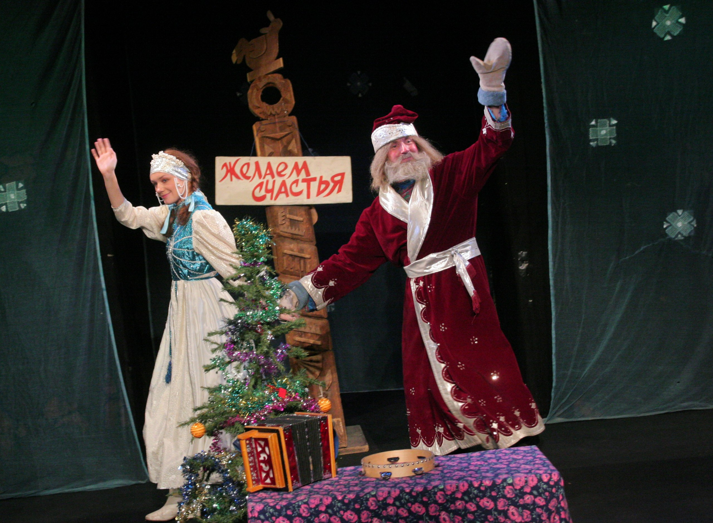

<blockquote>В этом спектакле, кажется, все сошлось: новогодняя тема, дух русской сказки и инсценировка, и вот результат — он держится в репертуаре уже 14 лет, такой снежный, добрый и музыкальный.

Михаил Александрович Левшин, художественный руководитель театра.</blockquote>

[Михаил Мокиенко](./mokienko.jpg)

Михаил Мокиенко, автор инсценировки, очень необычный человек. Писатель Эдуард Успенский назвал его «лучшим Дедом Морозом страны». Михаил создал детский театр Бурзачило, а сейчас занимается благотворительностью — у него проект «Театральная неотложка» — артисты ездят по больницам и играют спектакли для больных детей.

В основе спектакля «Волшебные сосульки» лежит сюжет классической сказки «Морозко», переосмысленный в инсценировке. Михаил Мокиенко приблизил традиционный сюжет к нашему времени. Девочка Настенька живет вместе с мачехой и ее дочкой, Груней. Родителей у Насти давно нет. Мачеха и Груня мечтают избавиться от Настеньки и посылают девочку срубить елку в лес, чтобы ее поймали и посадили в тюрьму. Но Настенька не смогла, пожалела елочку. В лесу она встречает Лесника, который оказывается Дедом Морозом — просто больше некому охранять лес, все разбежались зарабатывать деньги…

<strong>[img id='294' align='right' size='medium' alt='ispolatov']Алексей Николаевич Исполатов, режиссер спектакля:</strong>

<blockquote>Все спектакли, которые я ставил в этом театре, возникали неожиданно. Однажды я зашел к Михаилу Александровичу Левшину, нашему художественному руководителю, и он сказал — надо быстро поставить спектакль, есть такая хорошая пьеса «Волшебные сосульки», почитай, может, тебе понравится. Мы сделали вариант, в котором происходящее выглядело очень современно, но приметы оставили сказочные. Мне кажется, что много, что привнес Мокиенко в эту сказку симпатично, там есть очень милые песни, хорошие диалоги, и есть, что ставить. Спектакль мы выпустили весной. Несмотря на то, что есть Дедушка Мороз, да, действие происходит зимой, но нам показалось, что спектакль необязательно новогодний. Главное в нем было и остается — идея всепобеждающей доброты. Настеньку отличает самозабвенное желание помочь, поэтому ей хочется подражать.</blockquote>
Первые годы этот спектакль шел в репертуаре постоянно, независимо от времени года, потом его стали ставить как новогодний. За время существования спектакля сменилось много актерских составов, а вот роль Мачехи неизменно, каждый спектакль, исполняет одна актриса — Татьяна Кожевникова.

<strong>[img id='295' align='right' size='medium' alt='levshin']М. А. Левшин:</strong>

<blockquote>Мужество этой артистки, в хорошем смысле слова, как она это держит, заслуживает всякой поддержки и похвалы. Если бы существовало звание «Заслуженная артистка спектакля», то за «Волшебные сосульки», такое звание, безусловно, получила бы Татьяна Кожевникова!</blockquote>

<strong>А.Н Исполатов:</strong>

<blockquote>С самой первой репетиции она не просто принимает участие, а является стержнем этого спектакля. Она играет замечательно! Из года в год Татьяна Кожевникова участвует в каждом спектакле, и никого другого в этой роли мы не видим.</blockquote>
Мы расспросили актрису о том, как это — много лет подряд играть одну роль, ведь спектакль в новогодние праздники идет практически каждое утро.

<strong>[img id='296' align='right' size='medium' alt='kozhevnikova']Татьяна Кожевникова, исполнительница роли Мачехи:</strong>

<blockquote>С этой роли я начала службу в нашем театре. Усталость бывает чисто физическая: порой утром спектакль, днем репетиция, вечером опять спектакль — но не творческая. Мне всегда интересно, потому что один спектакль не похож на другой. Ведь каждый раз новые зрители. Я не позволяю себе скучать, когда выхожу на сцену, ведь здесь начинается импровизация, общение с детками — это оживляет и дает новые силы. С каждым годом образ чуть-чуть меняется, как и я, внешне и внутренне. Интересный процесс. Мачеха — злая и жадная. Однако, в конце наступает момент преображения. Она просит у Настеньки прощение, осознает, как важна в жизни любовь и доброта. Ведь самый смысл в вопросе Настеньки к зрителям: «А в чем счастье?» Детки отвечают: «В семье, в дружбе». А Настенька и говорит — счастье в том, чтобы тебя любили. То есть весь смысл — в любви.

[img id='311' align='left' size='medium' alt='kravchenko_2']

Даже если мы вязнем в житейской суете, то и в этом надо находить силы, учиться терпению и любви к каждому человеку. Также и Мачеха, такая приземленная, очень волевая, себялюбивая, жадная, поэтому она и злится на падчерицу. В финале она меняется, может не совсем, но ее сердечко теплеет и что-то раскрывается внутри. Уже хорошо. И дети прощают мою героиню, они от природы ангелы, все прощают.</blockquote>

Алексей Николаевич Исполатов, режиссер спектакля, также рассказал и о других актерах, ведь, несмотря на то, что в спектакле всего четыре персонажа, на каждую роль, кроме Мачехи, есть несколько исполнителей:

<blockquote>Также у нас замечательные исполнительницы роли Грушеньки, их сразу три, потому что много спектаклей — Юлия Горшенина играет привередливую дочь Мачехи 13 лет. Прекрасно вошла в эту роль Ася Пижель — ярко, выразительно, в гротесковом жанре. Очень здорово и оригинально делает эту же роль Юлия Бурцева, спасибо ей большое, она пришла в этот спектакль недавно и привнесла что-то новое.

Настеньку обычно играют самые молодые артистки театра — уже много — лет самая нежная и прекрасная — Наталья Терехова и, сравнительно недавно — юная легкая Алена Азарова.

Деда Мороза долго исполнял сам режиссер спектакля Алексей Исполатов. Сейчас эту роль играют Илья Безрук и Виталий Кравченко.</blockquote>

<strong>[img id='297' align='right' size='medium' alt='kravchenko']Виталий Кравченко, исполнитель роли Лесника-Деда Мороза:</strong>

<blockquote>Дедушку каждый обидеть может… Я стараюсь играть не просто деда Мороза, а Морозко, а он как добрый, так и строгий… Конечно, в нем больше добра — ведь он проверяет Груню, дает ей шанс исправится. Он верит, что добро все может изменить, и в финале Грушенька действительно меняется, как и Мачеха.

Зрители приходят разные, иногда дети уже и не верят в Деда Мороза, но даже когда они глазами улыбаются, уже хорошо. Был у нас один случай, тогда Настеньку играла Анна Загребна. Вдруг во время спектакля гаснет свет, а я как раз ухожу, чтобы принести ей что-нибудь вкусненькое. И Аня импровизирует: «Дедушка, ты что там понакрутил?» Оказалось, во всем квартале отключили свет, и мы играли под свет сотовых телефонов детей. Все дети — добрые и отзывчивые. Как Дед Мороз говорю, добро побеждает зло.</blockquote>

<strong>История от режиссера спектакля, Алексея Исполатова:</strong>

<blockquote>Еще на первых своих гастролях, после спектакля я как-то зашел в гримерку к актеру, Николаю Феоктистову, который первым играл роль Деда Мороза. Он сдирал с себя промокшую рубашку, под ней ватную толщинку тоже насквозь мокрую и приговаривал: «Вот, сосульки… жарче спектакля нет на свете!»</blockquote>

<strong>[img id='298' align='right' size='medium' alt='kozhevnikova_2']А Татьяна Кожевникова вспомнила случай, который произошел с ней на одном из спектаклей:</strong>

<blockquote>Один раз на выезде, в сцене, где мы спим с Грунечкой за занавеской, крепящейся к перекладине на двух столбах, Настенька уже ушла за елкой в лес, и тут вся конструкция начинает накреняться, а Грушенька кричит «Настя, Настя!» — она же привыкла, что ее одевают, за ней убирают, такая капризная и избалованная доченька, сама не может помочь. А в этот момент балка, столбы падают. Я собираю, все опять разваливается и я начинаю импровизировать, приговариваю: «Да, что это такое! избушка разваливается, как плохо, мужика в доме нет!» Все сама установила, зрители и не заметили ничего.</blockquote>

<strong>Наталья Курбатова, помощник режиссера:</strong>

<blockquote>Новогоднее настроение в нашем театре всегда начинается с «Волшебных сосулек». Мы рано отправляемся в Новый год: начинаем играть этот спектакль в ноябре, а прощаемся с Новым годом порой в конце февраля. А один раз, помнится, Дед Мороз вышел на нашу сцену в мае!</blockquote>

И напоследок!

<strong>Алексей Николаевич Исполатов:</strong>

<blockquote>Насколько у нас хватит сил — мы в театре все время должны говорить о главном — о добре, о том, что мы должны быть чуть-чуть лучше. Этот спектакль как раз об этом. Конечно, искусство никого не исправляло за раз. Но, думаю, я работаю в театре, который занимается именно этим — поддержанием баланса доброты.</blockquote>